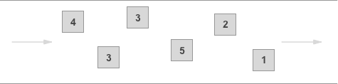
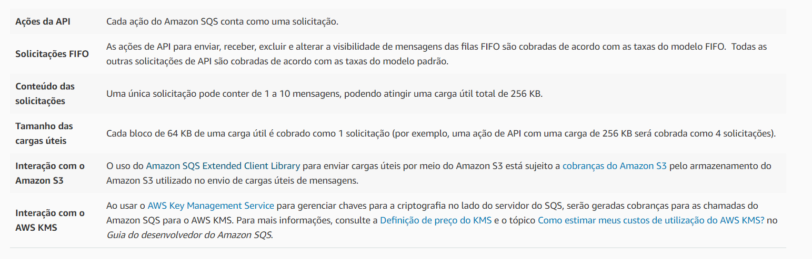
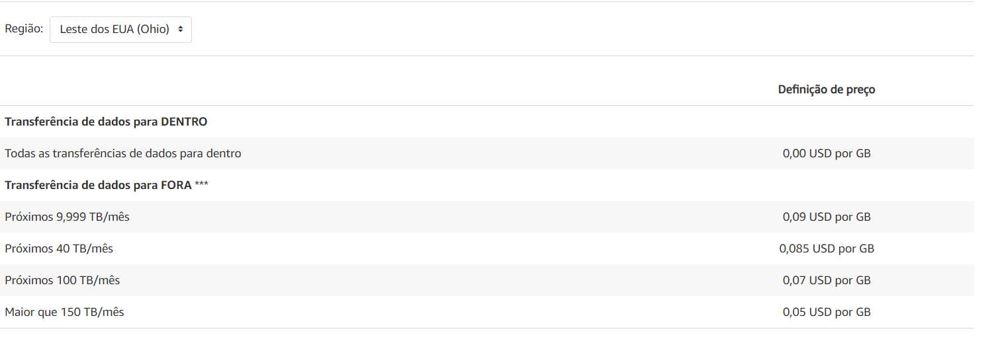

# Amazon SQS

O Amazon Simple Queue Service é um serviço de filas de mensagens gerenciado que permite desacoplamento e a escalabilidade de microsserviços, sistemas distribuídos e aplicações serverless permitindo enviar, armazenar e receber mensagens entre componentes de de software em qualquer volume, sem perdas ou necessidade de outros serviços.

## Vantagens

- Elimina a necessidade de uma infraestrutura própria para prover um serviço de mensageria altamente disponível e escalável.
- Capacidade de proteção dos dados trafegados utilizando Server Side Encryption para criptografar o corpo da mensagem
- Entrega de grandes volumes de dados com alto nível de confiabilidade.
- Ajuste de escala do serviço de acordo com a demanda, não necessitando de pré provisionamento da capacidade.
- Custos baseados no uso.

## Filas

O SQS disponibiliza dois tipos de filas de mensagem, a **padrão**, que devem ser utilizadas quando a aplicação possa processar mensagens que chegam mais de uma vez ou fora de ordem e a **FIFO**, para quando é essencial garantir a ordem dos eventos ou quando duplicatas não podem ser toleradas.

- As filas **padrão** oferecem:

  - Taxa de transferência ilimitada
    - Comportam um número quase ilimitado de transações por segundo
  - Entrega da mensagem pelo menos uma vez
  - Melhor ordenação possível
  - As mensagens podem ser entregues em ordem diferente do que foi enviado.

- As filas **FIFO** oferecem:

  - Alta taxa de transferência
    - 300 operações por segundo ou 3000 agrupando as mensagem em lotes de 10.
  - Garante a ordem das mensagens
    - A mensagem será entregue exatamente na ordem que foi enviada
  - Processa exatamente uma vez (uma vez lida, não voltará a fila, será excluída)
  - Não permite inserção de duplicatas na fila
  - Order FIFO, ou seja, a primeira mensagem a entrar será a primeira a sair.

## Funcionalidades gerais das filas

- Filas e mensagens ilimitadas
- Mensagens de até 256 KB de texto em qualquer formato.
  - Cada 64KB de dados é cobrado como 1 solicitação.
    - Para enviar payloads maiores que 256 KB pode-se utilizar a biblioteca de cliente estendida para Java do Amazon SQS, que usa o Amazon S3 para armazenar o payload da mensagem, sendo enviado a key do arquivo no Bucket da AWS como body na mensagem do SQS.
- Envio de mensagens em lotes de até 10 mensagens ou 256 KB. O custo do lote é o mesmo de mensagens únicas, o que significa que podemos diminuir ainda mais os custos para envios agrupados em lotes.
- É possível reduzir custos com chamadas utilizando Long Pooling, podendo uma chamada aguardar até 20 segundos por uma mensagem. As requisições que utilizam Long Pooling possuem os mesmos custos que uma requisição normal.
- Retenção de uma mensagem na fila em até 14 dias.
- Quando uma mensagem é recebida por uma consumer ela se torna invisível por um período que pode variar de 0 até 0 segundos, impedindo que outros serviços possam processá-la. Se houver falha no processamento e/ou tempo de invisibilidade acabar e a mensagem não for excluída ela volta para a fila de processamento.
- Compartilhamento seguros das filas com outras contas específicas da AWS
- Compartilhamento pode ser restrito pelo endereço IP e pelo horário do dia.
- Possibilidade de criptografar o corpo das mensagens.
- Possibilidade de implementação de uma Dead Letter Queue.

  - Quando a contagem máxima de recebimentos de uma mensagem for atingida ela poderá ser transferida para uma fila do tipo Dead Letter, associada, e do mesmo tipo, da fila de origem. Podendo ser consumidas para análise e compreensão do motivo que a mensagem ficou restrita.

## Uso do SQS com outros serviços da AWS

O SQS pode ser utilizado com outros serviços da AWS, como Redshift, DynamoDB, RDS, EC2, ECS, Lambda e S3 para aumentar a escalabilidade e a confiabilidade de aplicativos distribuídos. Veja a seguir alguns padrões de projeto comuns.

- Filas de trabalho
  - Evita o processamento intensivo de recursos imediatamente, e a espera para que este seja executado, agendando o trabalho para mais tarde. Enviamos o payload para o Broker que eventualmente executará a tarefa.
- Operações de buffer e lote
  - Acrescente escalabilidade e confiabilidade à sua arquitetura, e suavize picos de volume temporários sem perder mensagens ou aumentar a latência.
- Descarregamento de solicitações
  - Remova operações lentas de caminhos de solicitação interativos enfileirando a solicitação.
- Fanout
  - Combine o SQS com o SNS para enviar cópias idênticas de uma mensagem a várias filas em paralelo
- Prioridade
  - Use filas separadas para disponibilizar a priorização do trabalho
- Escalabilidade
  - Como as filas de mensagens dissociam seus processos, torna-se fácil expandir a taxa de envio e recebimento de mensagens: basta adicionar outro processo.
- Resiliência
  - A falha de parte do seu sistema não o desativa por inteiro. As filas de mensagens dissociam componentes do seu sistema, portanto, se um processo que estiver fazendo a leitura de mensagens da fila falhar, as mensagens ainda poderão ser adicionadas à fila para serem processadas quando o sistema for recuperado.

# Preço

- Pague somente o que usar
- Sem taxa mínima
- Todos os clientes podem fazer 1 milhão de solicitações gratuitas no Amazon SQS por mês.
- Preços com base na Região Leste dos EUA

  - De 1 milhão a 100 bilhões de solicitações/mês
    - 0,40 USD por milhão para fila padrão
    - 0,50 USD por milhão para fila FIFO
  - De 100 milhões a 200 bilhões de solicitações/mês
    - 0,30 USD por milhão para fila padrão
    - 0,40 USD por milhão para fila FIFO
  - Mais de 200 bilhões de solicitações/mês
    - 0,24 USD por milhão para fila padrão
    - 0,35 USD por milhão para fila FIFO

- [Verificar outras regiões](https://aws.amazon.com/pt/sqs/pricing/)

## Como as cobranças do SQS são calculadas

## Como é cobrada a transferência de dados do Amazon SQS?

- Os dados transferidos entre o Amazon SQS e o Amazon EC2 ou o Amazon SQS e o AWS Lambda dentro de uma única região são gratuitos (ou seja, custam 0,00 USD por GB). Os dados transferidos entre o Amazon SQS e o Amazon EC2 ou o Amazon SQS e o AWS Lambda em regiões diferentes serão cobrados de acordo com as taxas da transferência de dados via Internet em ambos os lados da transferência.
